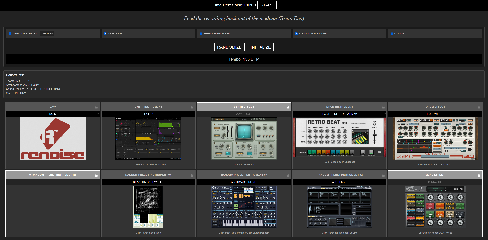
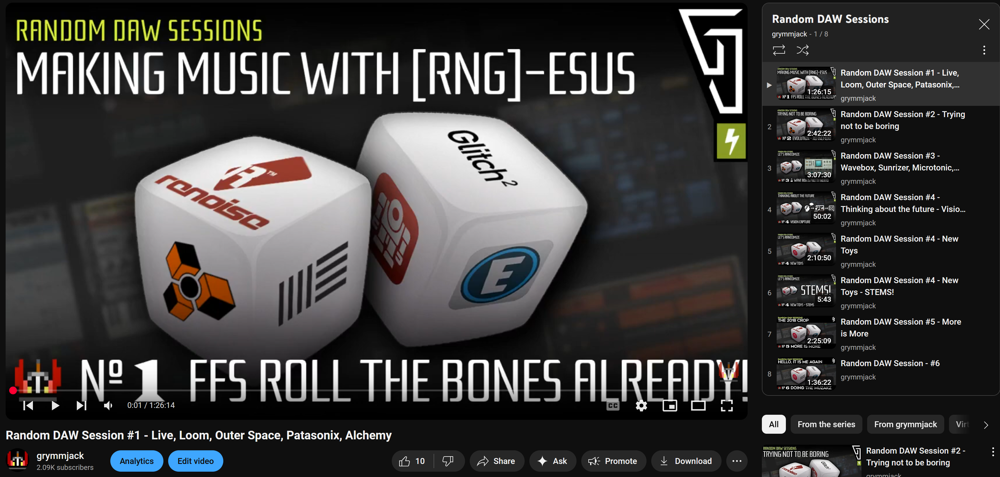

# Random DAW Session Generator

A React-based tool for generating random music production sessions with various constraints and parameters.

## Setup

1. Install dependencies:
```bash
npm install
```

2. Start the development server:
```bash
npm start
```

3. Build for production:
```bash
npm run build
```

## Features

- Random DAW/Host selection
- Synth and drum instrument randomization
- Effect randomization
- Time constraints
- Theme ideas
- Arrangement ideas
- Sound design ideas
- Mix ideas
- Oblique Strategies integration
- Conditional randomization (50% chance) for Synth, Drum, and Send Effects.
- Lock individual parameters to prevent them from being randomized using the padlock icon.
- Visual feedback: Displays corresponding images for most selected items (images expected in `public/images/`).
- Select and randomize a configurable number of specific preset instruments (up to 3).
- Optional time constraint with a visible countdown timer.

## SCREENSHOT


### THE OLD VERSION

Checkout the repo, and then this commit. This has the old jQuery one featured in my YouTube videos.
https://github.com/grymmjack/random-daw-session/tree/29227b40293280ec3627be45850a8cb759f980d7

[Random DAW Sessions YouTube Playlist](https://www.youtube.com/watch?v=WmpL8NCnWuI&list=PLLIsnFO_dy6O1ujATMyEG7kVRATAc4q7N)

